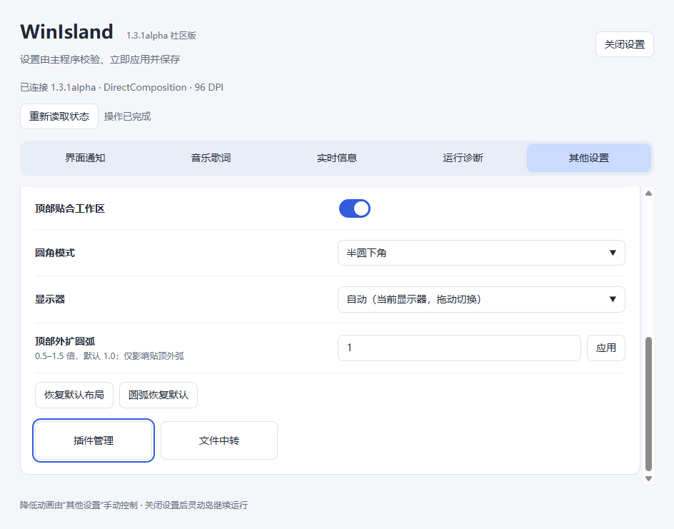
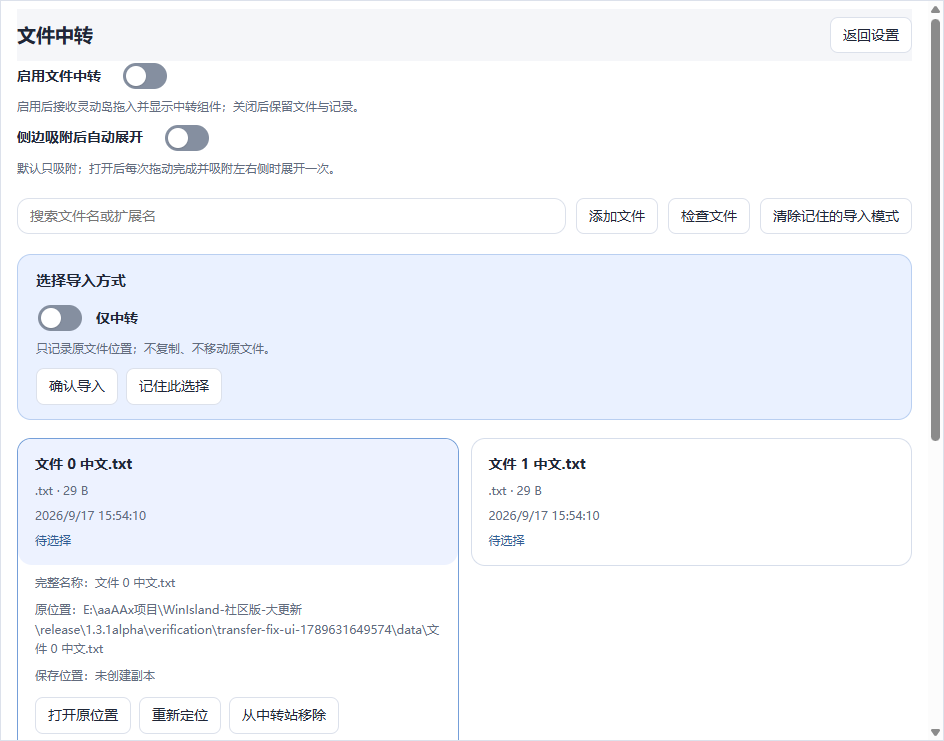
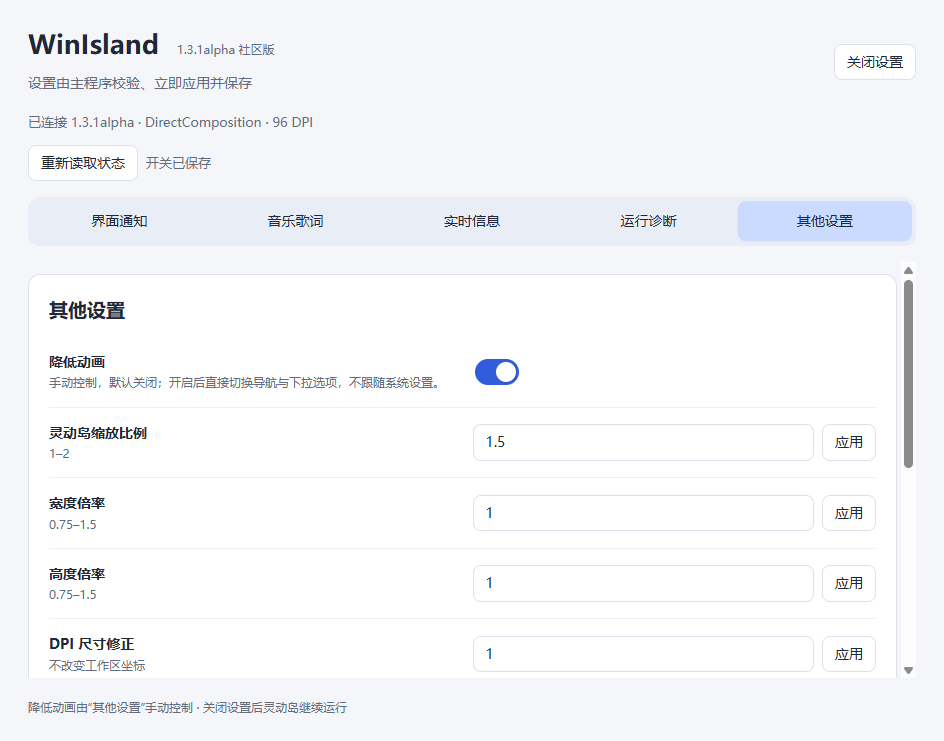
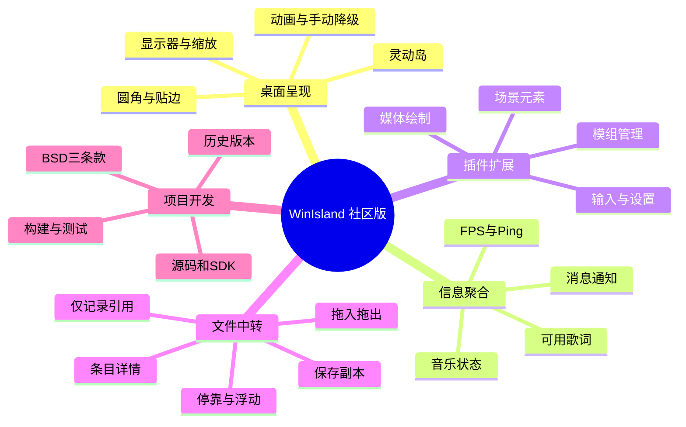

# WinIsland 社区版

**让音乐、消息、插件和文件中转聚合到 Windows 桌面的灵动岛中。**

WinIsland 是一个面向 Windows 的桌面交互项目：在屏幕边缘呈现紧凑的黑色灵动岛，在需要时展开音乐、歌词、通知或文件内容管理入口，并通过设置页面调整显示、布局和插件行为。本仓库整理从 **1.1.1 社区版到 1.3.1alpha** 的历史源码、构建产物和说明，便于使用、学习、追踪演进和继续开发。

项目自身采用 **BSD-3-Clause** 许可证。第三方依赖保留各自许可，详见 [第三方声明](THIRD_PARTY_NOTICES.md)。不同历史版本的功能、依赖和完整程度不同，请先查看对应版本 README。每个正式版号只保留找到的最新构建，fixed、path-state-fix、快照日期等额外后缀不作为产品版本。

> 最新归档：**[Winlsland-1.3.1alpha](versions/Winlsland-1.3.1alpha/README.md)**，构建标识 `1.3.1alpha-settings-adjust-20260917`。它属于 alpha 阶段，不把“最新”表述为“所有环境均已验证”。
>
> 文件夹按要求使用 **Winlsland-** 前缀；原项目名称、源码标识和原 EXE 仍为 **WinIsland**。两者是归档命名与产品命名的区别，不是重新命名源代码。

## 快速入口

- [下载发行版本](https://github.com/DxDxDxis/WinIsland-CE/releases) · [1.3.1alpha 预发布](https://github.com/DxDxDxis/WinIsland-CE/releases/tag/v1.3.1alpha) · [1.3.0 社区版](https://github.com/DxDxDxis/WinIsland-CE/releases/tag/v1.3.0)
- [版本列表：从新到旧](docs/VERSIONS.md)
- [安装、运行与配置](docs/INSTALL_AND_CONFIGURE.md)
- [源码构建与依赖准备](docs/BUILD.md)
- [架构及功能关系](docs/ARCHITECTURE.md)
- [文件来源、缺失项与整理规则](docs/ARCHIVE.md)
- [上传 GitHub 与发布成品](docs/GITHUB_PUBLISH.md) · [哪些文件要上传](docs/UPLOAD_CHECKLIST.md)
- [许可证](LICENSE) · [第三方许可](THIRD_PARTY_NOTICES.md) · [联系方式](#联系方式)

## 项目是做什么的

WinIsland 将分散在桌面上的状态和操作放到一个紧凑的交互区域中。它适合希望快速查看当前音乐、处理通知、运行桌面插件，或在不同应用之间暂存文件引用的用户，也提供了研究 Windows 原生渲染、媒体会话、插件 ABI、动画调度和 Electron 设置界面的完整演进材料。

| 能力 | 用途 | 使用边界 |
|---|---|---|
| 灵动岛外观与布局 | 黑色主体、贴边、尺寸/圆角/显示器等配置 | 具体选项随版本变化 |
| 音乐与歌词 | 展示歌曲、播放状态、控制与可用歌词 | 依赖播放器提供的真实媒体信息；无有效时间轴时不保证同步歌词 |
| 消息通知 | 在灵动岛显示通知，管理 Windows 原生横幅行为 | 系统或应用通知来源可能变化；显示消息与隐藏原横幅是独立选项 |
| 实时信息 | FPS / Ping 等可选状态 | 无有效采样时显示不可用，不能视作对所有应用的万能监测 |
| 插件管理 | 添加 `.wimod`、启用/禁用、查看详情、日志和插件设置 | 插件能力以对应 SDK/API 版本为准，运行第三方插件前确认来源 |
| 开放场景 | 向插件提供场景、元素、绘制、输入、媒体及设置扩展 | 主程序管理生命周期，插件布局与视觉仍需开发者负责 |
| 文件中转 | 文件引用/保存副本、搜索、详情、拖入拖出和边缘组件 | 1.3.1alpha 提供；不以加入条目自动执行文件；不同目标应用的拖放支持不同 |
| 设置界面 | 分类配置、模组入口、文件中转入口、手动降低动画 | 较新版采用 TypeScript + Electron；较早版本为原生/WPF 界面 |

这不是媒体播放器或消息应用的替代品。关闭灵动岛中的音乐显示不会停止外部播放器；关闭中转功能也不会删除已经记录的文件或用户原文件。

## 项目图片

以下图片来自项目的真实隔离测试窗口，使用测试文件和测试插件环境；不是概念设计图。图片中测试条目、路径与时间仅用于说明界面。

### 设置与并排入口（1.3.1alpha）



### 插件管理（1.3.1alpha）


### 文件中转（1.3.1alpha）



### 手动降低动画（1.3.1alpha）



图片来源及 SHA-256 见 [图片清单](docs/images/README.md)。历史版本外观以各版原说明为准。

## 功能思维导图



## 怎么安装和运行

1. 普通用户优先选择版本索引中的最新目标版本，阅读其已知限制。
2. 从 GitHub Releases 下载对应成品；本地完整归档中的成品位于各版本 `dist/`。
3. **1.3.1alpha** 的正式运行文件为 `WinIsland-1.3.1alpha.exe`。这是内嵌运行依赖的发行 EXE，首次运行按引导确认数据目录，通常优先建议 `D:\WinIsland`，磁盘不可用时根据现有规则选择可用位置。
4. 双击主 EXE。设置页由宿主启动，不单独双击 `WinIslandSettings.exe`。
5. 通过托盘或主程序已有入口打开设置，调整音乐、通知、显示器、尺寸、插件和文件中转。

推荐 Windows 10/11 x64。更早 WPF 版本和较新原生版本的最低要求有差异；查看版本自己的说明。历史多文件发行必须解压整个文件夹并保留依赖位置。不要将不同版本的 DLL、settings 或歌词服务互相混用。

源码仓库默认不提交大型成品、安装缓存或本机配置。**从 GitHub 下载源码 ZIP 不等于下载完整运行包**；要直接使用请选择 Releases，要开发请看 [构建说明](docs/BUILD.md)。

## 怎么配置

最新版设置包含五个主分类：**界面通知、音乐歌词、实时信息、运行诊断、其他设置**。

- **界面通知**：常驻、通知停驻时间、隐藏 Windows 自带通知、是否在灵动岛显示消息。
- **音乐歌词**：信息来源、播放器、歌词来源/API、是否在灵动岛显示音乐。显示开关与播放器本身的播放状态独立。
- **实时信息**：启用 FPS 或 Ping、设置 Ping 目标。
- **运行诊断**：信息监测与诊断报告入口，问题反馈时附版本和可复现步骤。
- **其他设置**：尺寸、显示器、顶部贴合、圆角、手动降低动画；底部进入插件管理或文件中转。

“降低动画”默认关闭，手动选择持久保存，不跟随系统自动改动；开启后导航和下拉直接达到最终状态，保留选中高亮，不停止业务复制或音乐。

文件中转默认不接管主岛拖入。进入页面启用后，可选择“仅中转”（保留原路径引用）或“保存并中转”（复制到数据根目录，不移动原文件）。移除中转记录不等于删除用户原文件。当前版本查看的是条目详情，不再提供文件内容预览。

新版统一数据根目录保存设置、插件、缓存、日志和中转记录；固定用户位置只保存安装定位信息。旧版的路径规则可能不同。详见 [配置与数据目录](docs/INSTALL_AND_CONFIGURE.md)。

## 目录结构

```text
gtb开源/
├─ README.md                    项目整体介绍（本文件）
├─ LICENSE                      项目自身 BSD-3-Clause
├─ THIRD_PARTY_NOTICES.md        第三方许可边界
├─ versions/                    每个正式版号的最新构建
│  ├─ Winlsland-1.3.1alpha/
│  │  ├─ README.md              本版本身份、运行、源码和成品哈希
│  │  ├─ project/               保留结构的源码、资源、SDK、原说明
│  │  └─ dist/                  已构建运行文件（本地保留，Git 忽略）
│  ├─ Winlsland-1.3.0社区版/
│  ├─ ...
│  └─ Winlsland-1.1.1社区版/
├─ extras/plugins/              找到的插件源码与开发资料
├─ shared/lyric-provider-source/ 歌词辅助程序与第三方源码
├─ licenses/                    集中保留的第三方声明
├─ docs/                        安装、构建、架构、归档和上传说明
│  └─ images/                   项目真实截图
├─ catalog/                     版本索引、复制清单、校验及检查报告
└─ tools/                       只读归档、校验和发布辅助脚本
```

完整倒序清单见 [VERSIONS.md](docs/VERSIONS.md)。目录本身没有固定的显示顺序：在资源管理器按名称降序查看；GitHub 的自动文件列表由平台排序，README 的版本表始终按新到旧排列。

## 全部正式版本（每版仅保留最新构建）

| 版本（新 → 旧） | 所选构建时间（UTC+08:00） | 源码情况 |
|---|---|---|
| [Winlsland-1.3.1alpha](versions/Winlsland-1.3.1alpha/README.md) | 2026-09-17 16:02:22 | 已找到源码 |
| [Winlsland-1.3.0社区版](versions/Winlsland-1.3.0社区版/README.md) | 2026-09-16 14:08:19 | 已找到源码 |
| [Winlsland-1.2.7alpha-r1](versions/Winlsland-1.2.7alpha-r1/README.md) | 2026-09-14 21:15:47 | 已找到源码 |
| [Winlsland-1.2.7alpha](versions/Winlsland-1.2.7alpha/README.md) | 2026-09-14 14:25:33 | 已找到源码 |
| [Winlsland-1.2.6alpha-c2](versions/Winlsland-1.2.6alpha-c2/README.md) | 2026-09-13 15:16:22 | 已找到源码 |
| [Winlsland-1.2.6alpha-c1](versions/Winlsland-1.2.6alpha-c1/README.md) | 2026-09-12 23:25:29 | 已找到源码 |
| [Winlsland-1.2.5alpha2](versions/Winlsland-1.2.5alpha2/README.md) | 2026-09-12 12:41:47 | 缺少完整对应源码 |
| [Winlsland-1.2.5alpha-r1](versions/Winlsland-1.2.5alpha-r1/README.md) | 2026-09-12 16:40:12 | 已找到源码 |
| [Winlsland-1.2.5alpha](versions/Winlsland-1.2.5alpha/README.md) | 2026-09-12 06:35:39 | 缺少完整对应源码 |
| [Winlsland-1.2.4beta_2](versions/Winlsland-1.2.4beta_2/README.md) | 2026-09-07 18:16:04 | 已找到源码 |
| [Winlsland-1.2.4beta](versions/Winlsland-1.2.4beta/README.md) | 2026-09-07 00:38:50 | 已找到源码 |
| [Winlsland-1.2.3beta_2](versions/Winlsland-1.2.3beta_2/README.md) | 2026-09-06 19:41:22 | 已找到源码 |
| [Winlsland-1.2.3beta](versions/Winlsland-1.2.3beta/README.md) | 2026-09-06 19:10:34 | 已找到源码 |
| [Winlsland-1.2.2beta](versions/Winlsland-1.2.2beta/README.md) | 2026-09-06 17:12:12 | 已找到源码 |
| [Winlsland-1.2.1beta](versions/Winlsland-1.2.1beta/README.md) | 2026-09-06 16:56:23 | 缺少完整对应源码 |
| [Winlsland-1.2.0社区版](versions/Winlsland-1.2.0社区版/README.md) | 2026-09-06 16:55:22 | 缺少完整对应源码 |
| [Winlsland-1.1.2社区版](versions/Winlsland-1.1.2社区版/README.md) | 2026-09-06 13:45:44 | 缺少完整对应源码 |
| [Winlsland-1.1.1社区版](versions/Winlsland-1.1.1社区版/README.md) | 2026-09-06 00:32:37 | 已找到源码 |

## 版本演进

| 阶段（新 → 旧） | 项目演进 |
|---|---|
| 1.3.1alpha | 音乐/消息显示开关、文件中转、停靠浮动与拖放；后续布局、接收底板和手动动画修复 |
| 1.3.0 | 紧凑插件卡片、搜索、模组设置、页面转场；统一目录和插件状态保存修复 |
| 1.2.7alpha-r1 | 多媒体皮肤、动态媒体与开放场景扩展 |
| 1.2.7alpha | C++ 宿主与 TypeScript + Electron 设置界面迁移 |
| 1.2.6alpha-c2 / c1 | 插件包、管理界面、JS 动画、设置接口与场景开放能力的不同修订 |
| 1.2.5alpha 系列 | 尺寸、贴顶轮廓、圆弧和布局迭代 |
| 1.2.4beta / beta_2 | 媒体识别、歌词来源、QQ 通知与原生布局迭代 |
| 1.2.3beta / beta_2 | 从早期 C# 框架向 C++ 原生核心重构 |
| 1.2.2beta 至 1.1.1 | 早期 WPF / C# 桌面通知、音乐与交互演进 |

归档不会虚构历史：部分早期版本仅存发布 EXE；已有源码工作区后来继续升级，不能视作所有早期成品的源码。每版 README 明确列出“已找到”“未找到”“未重新构建核对”。

## 参与开发

先选择一个版本，在自己的工作副本修改；不要跨版本混用 SDK 或用较新源码冒充旧版。报告问题请提供版本、BuildId、Windows 版本、DPI/显示器配置、最短复现步骤和已脱敏日志。提交代码前记录构建、测试结果与未验证场景。

架构和构建从 [开发者入口](docs/BUILD.md) 开始。原文档保留其历史语境，较早报告中的“当前最新”只对当时成立。

## 许可证

项目自身是开放源码项目，采用 **BSD 3-Clause License（BSD 三条款许可证）**，允许在遵守许可条款、保留声明且不擅自借作者名义背书的前提下使用、修改和再分发。完整法律文本见 [LICENSE](LICENSE)。

第三方依赖不统一改授 BSD，原有声明保留，特别是历史 GSAP 包和 Qt 模块应按各自许可处理。详情见 [THIRD_PARTY_NOTICES.md](THIRD_PARTY_NOTICES.md)。

## 联系方式

- 邮箱：**[725513212@qq.com](mailto:725513212@qq.com)**
- GitHub：仓库发布后可通过其 Issues 提交问题、通过 Pull Requests 贡献修改。

本目录是整理完成的本地开源归档，不表示已经上传或发布到 GitHub。
