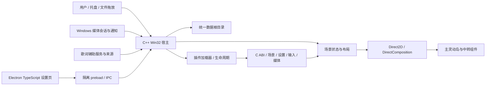
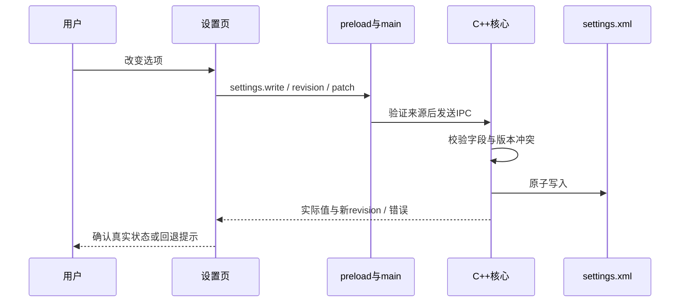
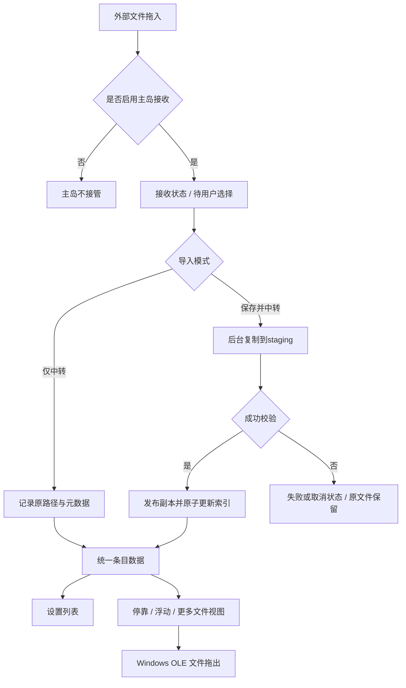
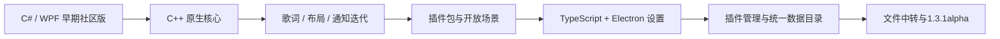

# 架构与交互关系

本页描述项目用途与较新主线架构，不将所有历史版本视为相同实现。

## 核心结构

设置页负责呈现与用户输入；核心负责真实配置校验、保存和生效。渲染页不通过开放 Node 或文件系统权限来绕过宿主。主程序生命周期、插件 ABI 和设置 UI 版本是不同概念。

## 设置保存

开关动画只表示视觉变化，不能替代核心成功响应。“降低动画”是普通持久化设置，不暂停媒体或文件复制。

## 文件中转

内部拖出后回到来源属于取消或返回，不应重新走外部导入。不同视图共用数据而不是各自维护独立副本。文件详情展示元数据与操作；当前版已经移除内容预览。

## 技术演进

产品快照、实验分支和源码片段分开归档；演进图表达主线关系，不代表每个阶段都有完整、可逐字节重建的历史源码。
